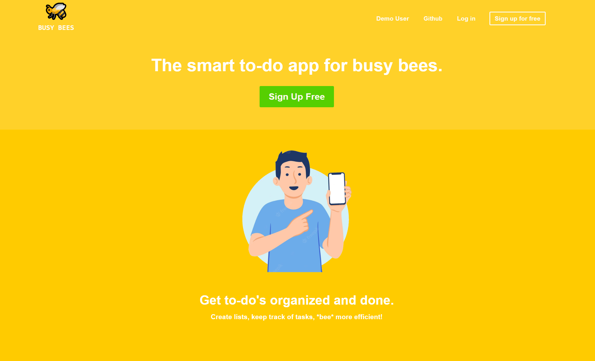
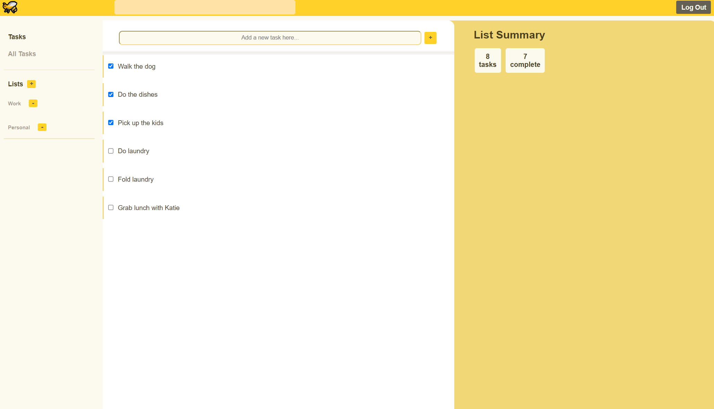

# Busy Bees
## Technologies Used:
* Javascript
* PUG.js
* HTML5
* CSS3
* Sequelize
* Express.js
* PostgreSQL
***
Busy Bees demo: https://busy-bees-attempt-2.herokuapp.com/

Github wiki: https://github.com/DylanPeate/Busy_Bees
***
## Team Members:
#### Dylan Peate
#### Anthony Rodriguez
#### Brian Kim
#### Danny Toan

***
## About
This project is based off of [Remember the Milk](https://www.rememberthemilk.com/).

[Busy Bees](https://busy-bees-attempt-2.herokuapp.com/), a _Remember the Milk_ clone, is a web application that allows users to create customized lists of tasks to help them keep organized in their everyday lives.

***

## How to Run
1. Download the [repository](https://github.com/DylanPeate/Busy_Bees.git) and open it in VS Code.
2. Install the necessary dependencies by running `npm install` in the terminal.
3. Create an `.env` file in the root of the project. Input the corresponding information from the `.env.example` file.
4. Create your local database.
    * Create a user named `busy_bees_app` with db privileges with your desired password.
    * Initialize sequelize with `npx dotenv sequelize init`.
    * Then run the following:
        * `npx dotenv sequelize db:create`
        * `npx dotenv sequelize db:migrate`
        * `npx dotenv sequelize db:seed:all`
5. Start the local server in your terminal by running `npm start`.
6. Navigate to `http://localhost:8080/` in Google Chrome.

***

## Languages and Frameworks
* [Pug.js](https://pugjs.org/api/getting-started.html): a template engine for Node. js and browsers to render dynamic reusable content.
* [Express.js](https://expressjs.com/): a prebuilt NodeJS framework that can help you in creating server-side web applications faster and smarter.
* [PostgreSQL](https://www.postgresql.org/): the primary data store or data warehouse for many web, mobile, geospatial, and analytics applications.

***

## Future Features
* Dark Mode
* Add priority levels to tasks/lists
* Sort by name, date created, priority
* Login by Username option

***

### Splash/Welcome Page

### Home Page (Logged In)

### Create a list

### Edit a task

